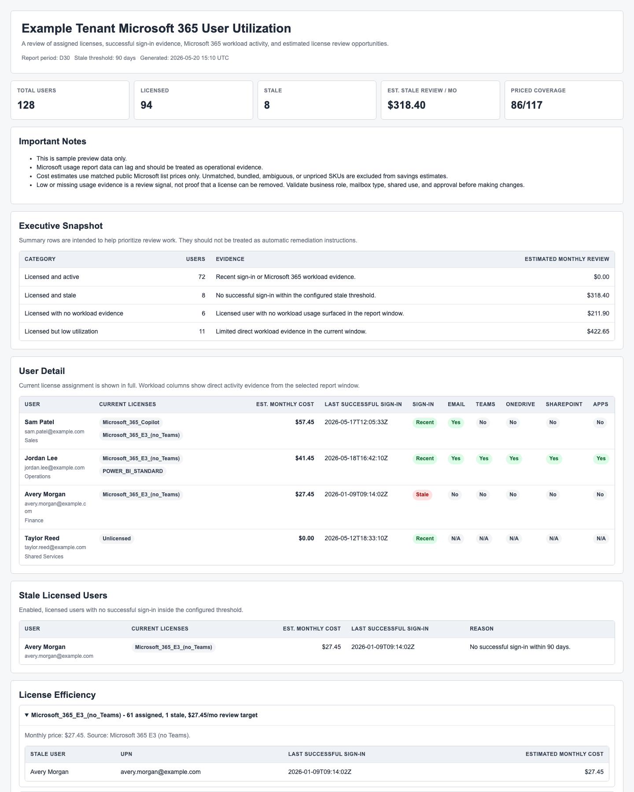

# Rewst Microsoft 365 User Utilization Report

A Rewst workflow and hosted HTML report for reviewing Microsoft 365 license utilization.

The report collects Microsoft Graph usage evidence, license assignment context, successful sign-in recency, and estimated license review opportunities.

## What Is Included

- `rewst/workflow-m365-utilization-community.bundle.json` - signed Rewst import bundle.
- `templates/m365-utilization-community-template.html` - plain HTML/Jinja report template source.
- `examples/m365-utilization-community-preview.html` - rendered example using sample data.
- `examples/m365-utilization-community-preview.png` - screenshot of the example output.

## What The Report Shows

- Total, licensed, stale, low-utilization, and unlicensed user counts.
- Assigned Microsoft 365 SKUs per user.
- Successful sign-in recency from the user baseline.
- Workload activity evidence for:
  - Office 365 active users
  - Exchange/Outlook email activity
  - Teams
  - OneDrive
  - SharePoint
  - Microsoft 365 Apps
- Estimated monthly license review opportunity for mapped SKUs.
- Stale licensed users and low-usage review candidates.
- License-level stale-user detail.

## Important Caveats

This report is an operational review aid. It does not prove that a license can safely be removed.

Before changing licensing, validate business role, mailbox type, shared account usage, employment status, legal hold or retention needs, and customer approval. Microsoft usage report data can lag, and missing workload evidence is not the same as confirmed non-use.

Cost estimates only include SKUs explicitly mapped in the workflow's price map. Unmatched, bundled, ambiguous, or unpriced SKUs remain visible but are excluded from estimated savings.

## Import Instructions

1. Download `rewst/workflow-m365-utilization-community.bundle.json`.
2. In Rewst, import the downloaded bundle.
3. Confirm the workflow imports with these objects:
   - `Microsoft: User Utilization Report`
   - `User Utilization Report Webhook`
   - monthly cron trigger
   - hosted report template
4. Set workflow variables for your tenant:
   - `tenant_name`
   - `report_period`: `D7`, `D30`, `D90`, or `D180`
   - `stale_days`: default `90`
   - `email_addresses`: comma-separated string or array
   - `exclusion_patterns`: optional UPN substrings for service/shared accounts
5. Open the email task and update the report link or message text if needed.
6. Run the workflow manually for one test tenant.
7. Review the hosted report output and confirm the data semantics before enabling the cron trigger.

## Microsoft Graph Calls

The workflow uses the configured Rewst Microsoft Graph integration to call:

- `GET /users?$select=id,displayName,userPrincipalName,mail,userType,department,jobTitle,companyName,accountEnabled,createdDateTime,assignedLicenses,assignedPlans,signInActivity&$top=500`
- `GET /subscribedSkus`
- `GET /reports/getOffice365ActiveUserDetail(period='{report_period}')`
- `GET /reports/getEmailActivityUserDetail(period='{report_period}')`
- `GET /reports/getTeamsUserActivityUserDetail(period='{report_period}')`
- `GET /reports/getOneDriveActivityUserDetail(period='{report_period}')`
- `GET /reports/getSharePointActivityUserDetail(period='{report_period}')`
- `GET /reports/getM365AppUserDetail(period='{report_period}')`

Make sure your Microsoft Graph/Rewst integration has the permissions needed for user, sign-in activity, subscribed SKU, and usage report reads in your environment.

## Default SKU Price Map

The workflow includes a small starter price map for common SKUs. You should review and update it for your market, contract terms, and customer pricing model before using any savings estimates.

Mapped examples include:

- `Microsoft_365_E3_(no_Teams)`
- `Microsoft_365_Copilot`
- `POWER_BI_STANDARD`
- `PBI_PREMIUM_PER_USER`
- `PROJECTPREMIUM`
- `AAD_PREMIUM_P2`
- `Microsoft_Teams_Enterprise_New`

## Template Notes

The repository includes a plain HTML/Jinja template source and preview files for review. The importable bundle itself should stay exactly as exported from Rewst so its signing metadata remains valid.

## Known Limitations

- The user query currently requests the first 500 users. Add paging if your tenant can exceed that.
- CSV parsing in the workflow is intentionally simple and assumes Microsoft report CSV columns remain stable.
- Pricing is a review estimate, not billing truth.
- The shared import bundle must remain an unmodified Rewst export so its hashes and signing metadata stay valid.

## Sanitization

This repository contains a Rewst-generated import bundle plus supporting source/template material. Do not sanitize a Rewst bundle by editing the JSON after export; make changes in Rewst and export a new bundle.
